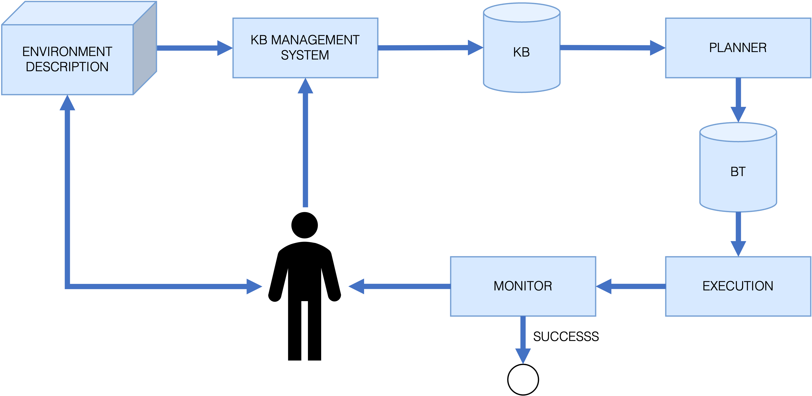

<a href="https://www.swi-prolog.org/" target="_blank">
    
</a>
<a href="https://www.python.org/" target="_blank">
    
</a>
<a href="https://www.ros.org/" target="_blank">
    
</a>
<a href="https://ubuntu.com/" target="_blank">
    
</a>

<p align='center'>
    <h1 align="center">Probabilistic and Logic Oriented Planning (PLOP)</h1>
</p>

----------

- [Project Description](#project-description)
- [Framework structure](#framework-structure)
- [Project Structure](#project-structure)
- [Clone the repo](#clone-the-repo)
- [Requirements](#requirements)
  - [Prolog](#prolog)
  - [Python dependencies](#python-dependencies)
  - [C++ / ROS2 dependencies](#c--ros2-dependencies)
- [Compiling](#compiling)
- [Running](#running)
  - [The whole framework](#the-whole-framework)
  - [GPT Fine-Tuning](#gpt-fine-tuning)
  - [LLM KB Generation](#llm-kb-generation)
  - [Prolog](#prolog-1)
- [References](#references)
- [Known issues](#known-issues)
- [Future works](#future-works)
- [Contributors](#contributors)

## Project Description
The goal of this project is to create a general multi-agent planning framework which emplys LLMs capabilities to populate a Prolog knowledge base. 

## Framework structure


## Project Structure


Briefly, the main folders are:
- `llm_kb_gen` includes the code to call the LLM to generate both the high-level and low-level KBs.
- `prolog_planner` contains the code for planning using Prolog, both the total-order planning and the achievers and resource extraction.
- `python_interface` includes the Python code to:
  1. automatically call the Prolog planner,
  2. set-up and solve the MILP problem,
  3. generate the behaviour tree to be executed.
- `behaviour_tree` contains the C++ and ROS2 code for behaviour tree construction and communications. It exploits [BehaviourTree.CPP](https://github.com/BehaviorTree/BehaviorTree.CPP).
- `prolog_project` includes the ROS2 node (motion node and **planner** node)
  - scripts: Contains the two node plus the utilities
  - msg: Contains the `.msg` file for ROS communication

## Clone the repo

The repo uses external libraries for some modules, so one must either clone it with all the submodules:

```
$ git clone --recurse-submodules git@github.com:idra-lab/PLOP.git
```

or initialize the submodules at a later time:

```
$ git clone git@github.com:idra-lab/PLOP.git
$ git submodule update --init --recursive --remote 
```

## Requirements

### Prolog

Install the [SWI-Prolog](https://www.swi-prolog.org/download/stable) interpreter.

### Python dependencies

There are a number of Python dependencies to be installed before being able to run the code. You can do so by running:

``` bash
$ python3 -m pip install  -r requirements.txt
```

SUGGESTION: before installing the requirements, install the `virtualenv` package with python and create a virtual environment 

```bash
$ python3 -m pip install -U virtualenv
$ virtualenv venv
$ source venv/bin/activate
```

The `requirements.txt` file contains the relative path to the other `requirements.txt` files. Otherwise install the packages for the single modules manually. 

### C++ / ROS2 dependencies

To compile and execute the behaviour tree part, a C++ development environment is required. Also ROS2 must be installed and working. The framework was tested using ROS2 Humble, which can be installed following [this guide](https://docs.ros.org/en/humble/Installation/Ubuntu-Install-Debians.html) for Ubuntu 22.04 (native), or by using [RobotStack](https://robostack.github.io/GettingStarted.html) on almost every other operating system (works also with Mac with M* CPUs).

The other needed dependencies are [BehaviourTree.CPP](https://github.com/BehaviorTree/BehaviorTree.CPP) and [BehaviourTree.ROS2](https://github.com/BehaviorTree/BehaviorTree.ROS2), which should have been downloaded as submodules in the [Clone the repo](#clone-the-repo) section.

If you are planning to use ROS2 and not to manually compile `behaviour_tree`, you can skip this paragraph. The framework uses [BehaviourTree.CPP](https://github.com/BehaviorTree/BehaviorTree.CPP) and [BehaviourTree.ROS2](https://github.com/BehaviorTree/BehaviorTree.ROS2) to execute and monitor the BTs. Please, if you are compiling with cmake and not colcon, visit the website to install the due dependencies (i.e., gtest, ZeroMQ and SQlite). Obviously, the nodes of the tree must also be changed accordingly, since the default ones are nodes sending messages to topics. 


## Compiling

In order to correctly run the framework, we need behaviour trees to be working and for them to be working we need to be able to compile them, so please verify that you have a working ROS2 environment before proceeding. Once you are sure you have, enter the `behaviour_tree` directory and run `colcon`.

```bash
$ cd behaviour_tree
$ colcon build && source install/setup.bash
```

This should automatically compile the `BehaviourTree.{CPP,ROS2}` packages as well as the `behaviour_tree` package used by the framework.

## Running

It's possible to both run the whole framework at once (next section), or to run single components (the other sections). 

### The whole framework

To run the whole framework you just need to run the Python script in the main directory.

```
$ python3 run_framework.py
```

### GPT Fine-Tuning

Conversation data between a user and an assistant is stored in YAML files. To make this conversational data usable for fine-tuning purposes—improving the abilities of such language models—it needs to be converted into the JSONL as a means of ensuring compatibility and integration with fine-tuning.

<ins>YAML to JSONL Conversion for GPT Fine-Tuning</ins>

Fine-tuning large language models like GPT entails well-formatted data in a suitable format. YAML is a human-readable and structured format, while GPT models utilize the JSONL format for fine-tuning.
Thus, It is necessary to convert YAML files into JSONL in order to ensure compatibility.

<ins>Execution</ins>: Run the converter script, specifying the input YAML file(s) and desired output directory:
```bash
python3 dataset_generator.py -y <path_to_yaml_file_1> <path_to_yaml_file_2> <path_to_yaml_file_3> 
```

To shuffle the data during conversion:
```bash
python3 dataset_generator.py -y <path_to_yaml_file_1> <path_to_yaml_file_2> <path_to_yaml_file_3> -s true 
```

### LLM KB Generation

You can run the knowledge creation by calling the python script `gpt_convo.py`. It uses few-shots learning to teach the LLM how to respond. The examples are in the `few-shots.yaml` file, but other files can be added by using hte `-y/--yaml-files` arguments:

```bash
python3 llm_kb_gen/gtp_convo.py -y <path_to_yaml_file_1> <path_to_yaml_file_2> <path_to_yaml_file_3>
```

If not YAML file is passed, the default one will be used.

Notice that the structure of the YAML file should be:
```YAML
entries:
  system_msg:
    role: 
    content: 
  convo:
    0:
      Q:
        role:
        content:
      A:
        role:
        content:
    1:
      Q:
        role:
        content:
      A:
        role:
        content:
```

### Prolog

You can run a series of tests

## References

```bibtex
@misc{saccon2023prolog,
      title={When Prolog meets generative models: a new approach for managing knowledge and planning in robotic applications}, 
      author={Enrico Saccon and Ahmet Tikna and Davide De Martini and Edoardo Lamon and Marco Roveri and Luigi Palopoli},
      year={2023},
      eprint={2309.15049},
      archivePrefix={arXiv},
      primaryClass={cs.RO}
}
```

## Known issues
- LLMs fine-tuning is not currently working

## Future works
- Get the blocks info with machine learning methods (e.g. neuro problog)
- Optimize the makespan selecting the blocks that are faster to build 

## Contributors
- Enrico Saccon: enrico.saccon@unitn.it
- Ahmet Tikna: ahmet.tikna@unitn.it
- Syed Ali Usama: aliusama.syed@unitn.it
- Davide De Martini: davide.demartini@studenti.unitn.it
- Edoardo Lamon: edoardo.lamon@unitn.it
- Marco Roveri: marco.roveri@unitn.it
- Luigi Palopoli: luigi.palopoli@unitn.it


